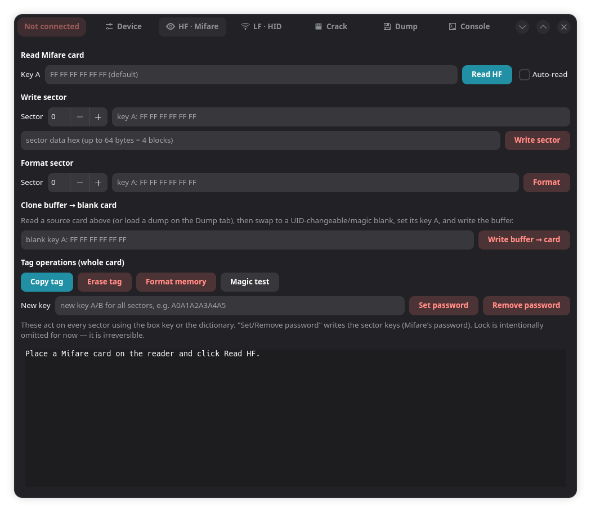
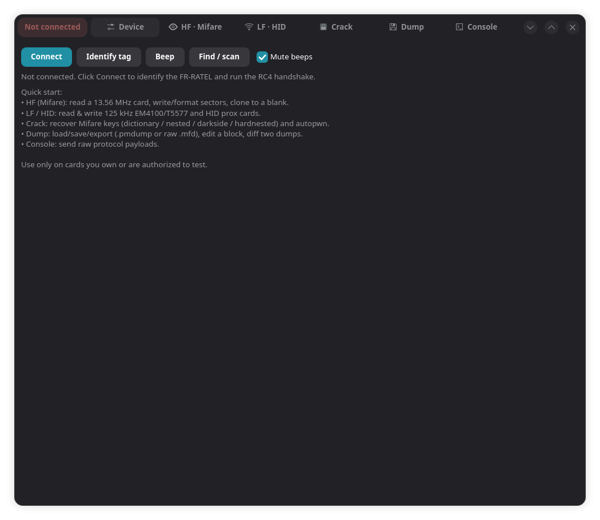
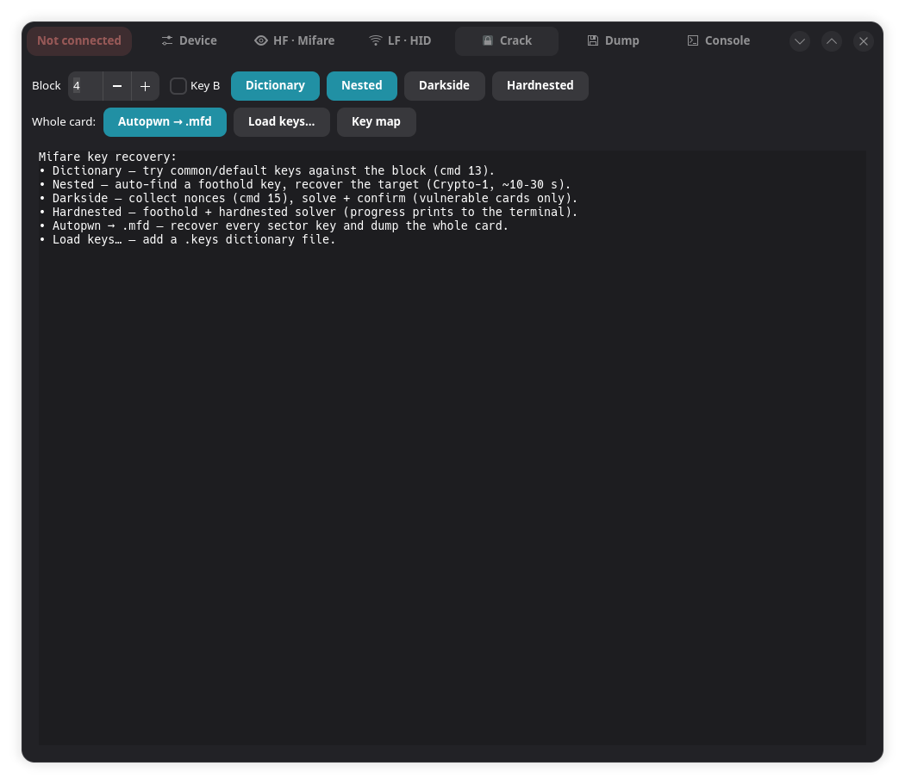
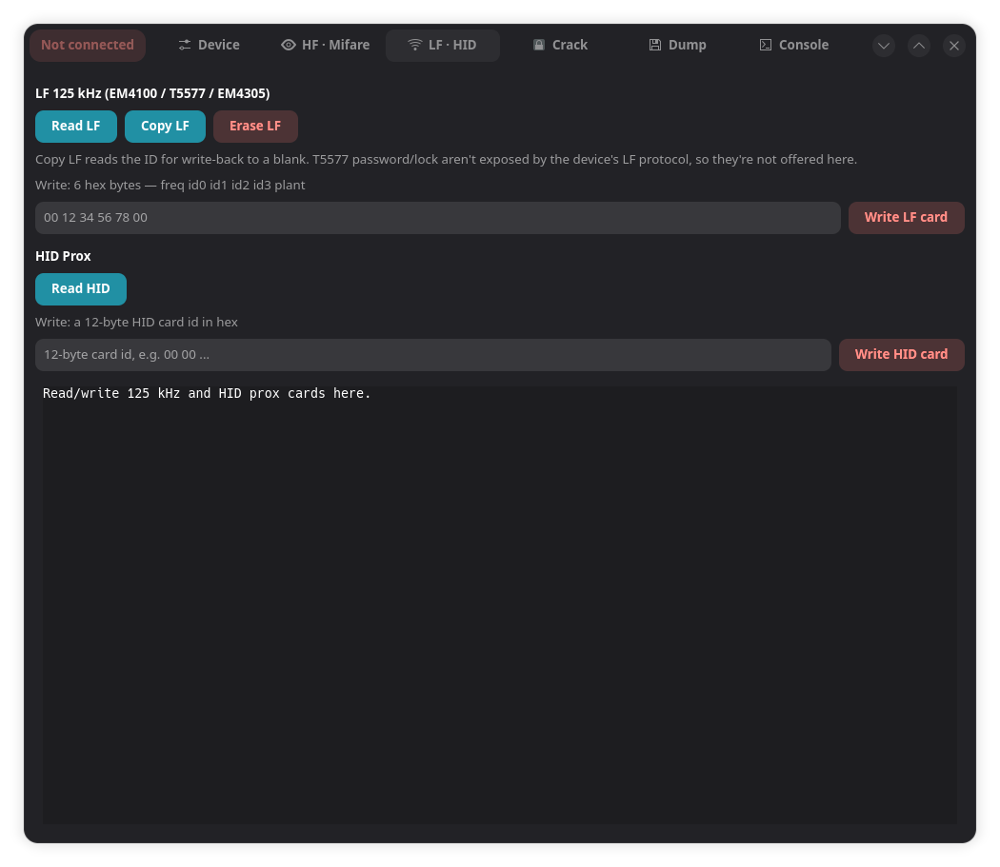
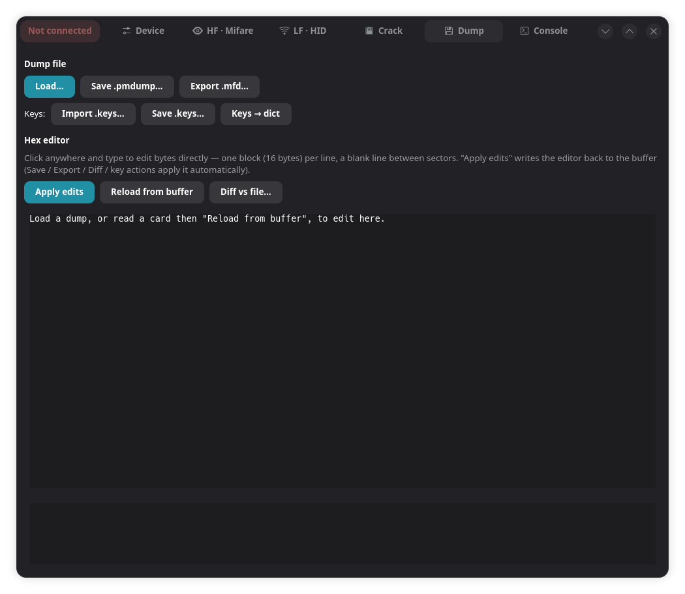
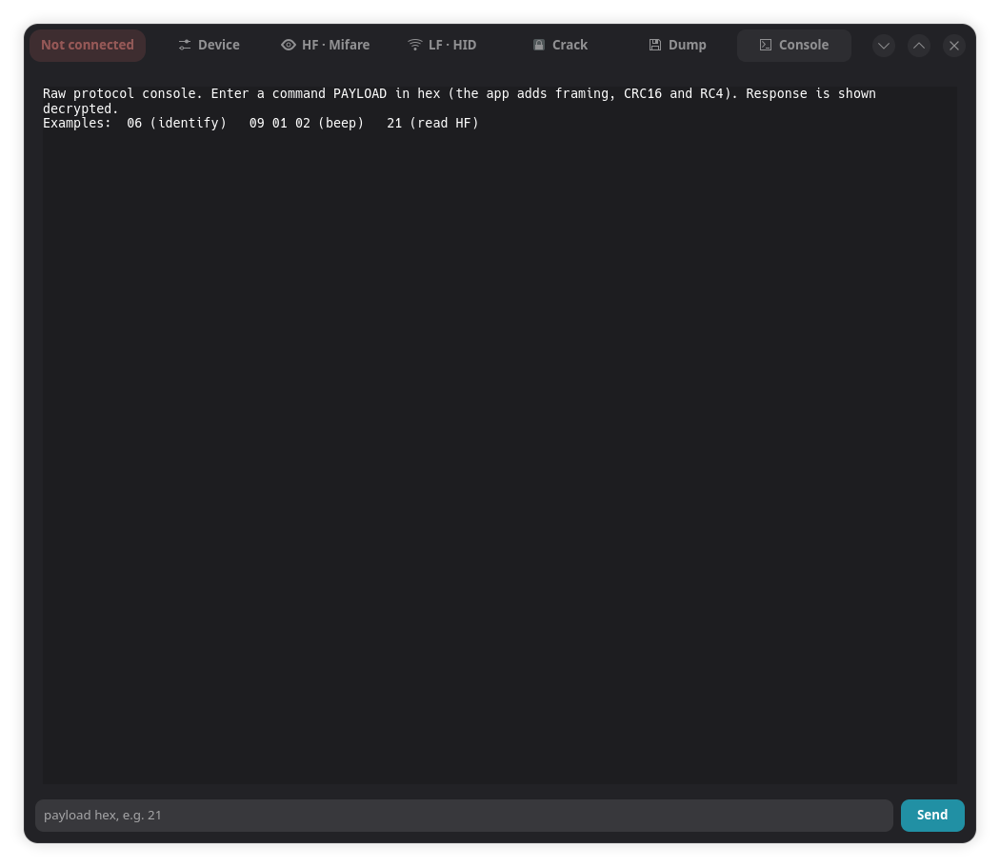

# NFC PM-Pro — open companion app

An independent Linux companion/replacement for the **FURUI NFC PM-Pro** (`FR-RATEL`,
USB `1629:1831`) RFID reader/writer/copier — built in C with a GTK4/libadwaita GUI,
talking to the device over its native (reverse-engineered) HID protocol. No vendor
software, no Wine needed at runtime.

## Screenshots

The **HF · Mifare** tab — read a card with a key, write/format a sector, clone to a
blank, and whole-card tag operations:



| | |
|---|---|
| **Device** — connect, identify, beep | **Crack** — dictionary / nested / darkside / hardnested + autopwn |
|  |  |
| **LF · HID** — 125 kHz EM4100/T5577 + HID prox | **Dump** — load/save/export, hex editor, diff |
|  |  |
| **Console** — send raw protocol payloads | |
|  | |

## What works (all verified on real hardware unless noted)
- **Connect** — identify + RC4 handshake.
- **Identify tag** — one button (Device page) / `pmctl identify` that auto-detects
  whatever is on the reader: HF 13.56 MHz, then 125 kHz LF, then HID prox. Names
  the type (Classic 1K/4K/Mini, Plus, DESFire, Ultralight/NTAG family, …) and
  flags gen1a/UID0 magic cards. Note: the device only reports ATQA+SAK, so the
  Ultralight/NTAG family can't be split into UL / UL-C / EV1 / NTAG21x (that needs
  a GET_VERSION frame the PM-Pro protocol doesn't expose — the OEM app can't
  either).
- **Magic test** — a button (HF tab) / `pmctl magic` that tells a genuine card
  from a UID-changeable **magic** card. Detects **gen1a** (cmd 1D backdoor) and
  **gen2/CUID** (block 0 writable) — the latter by flipping one block-0 byte,
  reading it back, then restoring it. (A CUID card is read-identical to a real
  one, so this is the only way to spot it; it writes block 0 and restores it.)
- **Read HF** (13.56 MHz, ISO14443A) — UID/type, and a per-sector dump. Each
  sector is read with the key in the box, falling back to the dictionary
  (built-in + loaded `.keys` + keys imported from a dump). Output is rendered
  MifareClassicTool-style: one block per line, sectors spaced apart, with the
  UID/manufacturer block, Key A, access bits and Key B colour-coded.
- **Read / Write / Clone Mifare sectors** — read sectors with a key, write a
  sector, and clone a buffered card to a blank (auto-restoring the trailer key).
- **Read / Write LF** (125 kHz, EM4100/T5577/EM4305) and **HID prox** (read/write).
  LF reads decode the EM4100 customer/card number + fob text.
- **Save / Load dump** — save a read card to a `.pmdump`, or load one back into
  the buffer to write to a blank. Load auto-detects raw binary `.mfd` dumps
  (e.g. autopwn output, or libnfc/Proxmark dumps) as well as `.pmdump`.
- **Edit / diff dumps** — the GUI Dump tab has an editable hex editor (click and
  type, one block per line, colour-coded), and a byte-level **Diff Tool** window
  (per-byte highlighting, % difference, hide-identical), à la MifareClassicTool.
  Offline: `pmctl dumpset <file> <blk> <hex>` / `dumpdiff <a> <b>` / `dumpconv <in> <out>`.
- **Import / export `.keys`** — import MifareClassicTool-style `.keys`
  dictionaries (GUI Crack/Dump tab, or `pmctl dict <blk> <type> <file>`) to
  extend the dictionary used by Read / Dictionary / Nested / Autopwn / tag ops;
  or export a dump's recovered Key A/Key B values to a `.keys` file.
- **Crack** — four Mifare key attacks, plus whole-card autopwn:
  - **Dictionary** (cmd 13) — tries common/default keys; returns the one that
    authenticates. *(verified live)*
  - **Nested** (cmd 14) — the classic mfoc attack: with one known/default
    sector key (auto-found via the dictionary) it recovers the rest via
    Crypto-1 + nonce-distance, confirmed on-card. **Verified: cracked a real
    fob's 7 unknown sector keys, ~10–30 s each.**
  - **Darkside** (cmd 15) — collect + Crypto-1 solve + on-card confirm; for
    cards vulnerable to the parity-leak (hardened cards are reported as such).
  - **Hardnested** — the full **mfoc-hardnested** solver ported to pure C
    (AVX512/AVX2/SSE2/NOSIMD, 16-thread, ~5 G keys/s), fed by the device's
    nonce collection (cmd 0x30); auto-finds a foothold via the dictionary, like
    mfoc. *(solver runs; end-to-end needs a hardened card with a foothold key)*
  - **Autopwn → .mfd** — dictionary + nested across every sector, then reads the
    whole card and writes a raw **`.mfd`** dump (recovered keys in the trailers),
    loadable by standard Mifare tools. *(verified: full 1K fob dumped, 16/16
    sectors keyed and read)*
- **Format** a sector, **beep** (with a mute toggle), **find/scan** (openfind),
  raw **console** (send a payload; see the decrypted reply).
- **Tag operations** (Mifare Classic) — Copy, Erase, Format memory, Set/Remove
  password. Each finds a per-sector key (box key → dictionary → nested), writes
  the trailer with Key B when it's required (recovering it automatically), resets
  sector 0 via the device's `cmd 16` format (its block 0 is read-only), and
  **verifies every write by reading the sector back** — it won't claim a change it
  can't prove. Plus Copy/Erase for LF EM4100. (Lock is deferred — it is irreversible.)
- **Records (NDEF)** — build and write NDEF records onto a Mifare Classic card,
  and read them back. Supports **Text**, **URL / URI** (with the well-known scheme
  prefixes — so http(s), `tel:`, `mailto:`, video / file links are all
  covered), **Social media** (pick a platform — X, Instagram, LinkedIn, YouTube,
  TikTok, GitHub, WhatsApp, … — plus a handle, and it builds the profile URL),
  **Review / app link** (Google Review by Place ID, Google Maps, Yelp, Play Store /
  App Store, Spotify, PayPal.me / Venmo / Cash App — you supply the business-specific
  ID or paste the review link from your Google Business Profile; the app can't look
  it up for you), **Smart Poster** (a URL with a title), **Contact** (vCard), **Android
  Application Record**, **geo:** location, custom **MIME** and **External** types,
  and a **raw** record editor — composed into a multi-record message. They're
  stored via the MAD + NDEF mapping (NDEF key `D3F7D3F7D3F7`), so **Android phones
  read them** (iOS does not read NDEF on Mifare Classic). This device has no
  Ultralight/NTAG page write, so NDEF goes on Classic only — and because the MAD
  lives in sector 0, a **magic (gen2/CUID) card** is needed for a phone-readable
  tag (on a genuine card block 0 is read-only, so the data sectors get written but
  the MAD doesn't — verified on hardware). CLI:
  `pmctl ndefencode <type> …` (offline preview), `pmctl ndefwrite <type> …`,
  `pmctl ndefread`.
- **Card insight** — card-type detection (SAK/ATQA), decoded access conditions
  and value blocks (shown inline), and a per-sector **Key map** grid.
- **Auto-read** — optionally poll and read a card automatically when placed.
- **Write confirmations** — destructive writes ask before touching a card.

The GUI has seven tabs — **Device**, **HF · Mifare**, **LF · HID**, **Crack**,
**Dump**, **Records**, **Console** — each with its own log so an action's output
appears next to it. Preferences (mute, default key, window size, imported `.keys`) persist in
`~/.config/pmpro/settings.ini`.

The protocol (RC4 + CRC-16/CCITT + framing, full command table) is documented in
[PROTOCOL.md](PROTOCOL.md). It was recovered from the official `PM_Pro.exe`
(decompiled with ilspycmd) and verified against the live device.

> Not ported (by choice): firmware update (bricking risk), hotel-card presets, and
> agreements for other device models. The Crypto-1 cipher + solver have self-tests
> (`ctest`).

## Build
Needs GTK4 + libadwaita, `liblzma`, a C compiler, and CMake/Ninja. The device I/O
is pure `/dev/hidraw` — no libusb/hidapi.

Install the dependencies:
```sh
# Arch / Manjaro
sudo pacman -S --needed base-devel cmake ninja gtk4 libadwaita xz

# Debian / Ubuntu
sudo apt install build-essential cmake ninja-build libgtk-4-dev libadwaita-1-dev liblzma-dev pkg-config

# Fedora
sudo dnf install gcc cmake ninja-build gtk4-devel libadwaita-devel xz-devel pkgconf
```
Then build:
```sh
cmake -G Ninja -S . -B build && ninja -C build
./build/pmpro           # GUI
./build/pmctl connect   # CLI: connect+beep
./build/pmctl identify  # CLI: auto-detect the tag on the reader + its type
./build/pmctl readic    # CLI: read a 13.56 MHz card
```
Install it as a desktop app (adds a launcher + icon):
```sh
cmake -G Ninja -S . -B build -DCMAKE_INSTALL_PREFIX=/usr && sudo ninja -C build install
```

## Device access (one-time)
The HID node is root-only by default. Install the udev rule:
```sh
sudo cp tools/99-pmpro.rules /etc/udev/rules.d/ && sudo udevadm control --reload-rules && sudo udevadm trigger
# then unplug/replug the device
```

## Layout
- `src/furui.[ch]` — RC4 cipher, CRC16, packet framing.
- `src/session.[ch]` — connect handshake, command exec (multi-report send/recv + decrypt).
- `src/hidraw.[ch]` — dependency-free hidraw transport (auto-discovers the device).
- `src/protocol.[ch]` — hex/parse, card-type, value-block & access-condition decode.
- `src/crack.c`, `nested.c`, `crypto1.c`, `hardnested_glue.c`, `hardnested/` — key recovery.
- `src/dump.[ch]` — `.pmdump` / `.mfd` / `.keys` load · save · diff.
- `src/ndef.[ch]` — NDEF records (encode/decode) + the Mifare Classic NDEF mapping.
- `src/app.c` — GTK4/libadwaita GUI. `src/pmctl.c` — CLI. `src/probe.c` — RE probe.
- `tests/` — Crypto-1 + dump/protocol self-tests (`ctest`).
- `data/` — `.desktop` launcher + icon. `tools/99-pmpro.rules` — udev rule.

## Contributing
Patches welcome — see [CONTRIBUTING.md](CONTRIBUTING.md) for build/test setup, code
style, how to verify protocol changes against the device, and the GPLv3 / no-vendor-code
ground rules.

## Responsible use
This device and app read/write/clone RFID/NFC cards and include Mifare key-recovery.
Use **only** on cards and systems you own or are explicitly authorized to test
(your own access cards, hotel/office administration you manage, security research
with permission). Cloning credentials you don't own may be illegal.

## License
`src/crypto1.c` ports **crapto1** (bla <blapost@gmail.com> & Proxmark3
contributors) and `src/hardnested/` vendors the **mfoc-hardnested** solver
(piwi/Proxmark3 + nfc-tools) — both **GPL** — so this project as a whole is
distributed under **GPLv3**. The vendored solver is decoupled from libnfc; nonce
collection comes from the PM-Pro (cmd 0x30) via `src/hardnested_glue.c`.

See **[LICENSE](LICENSE)** for the full GPLv3 text, **[NOTICE](NOTICE)** for
third-party attribution and provenance (all other `src/` code is original, written
from `PROTOCOL.md` — no decompiled vendor code is included), and
**[DISCLAIMER](DISCLAIMER)** for intended/authorized use.
